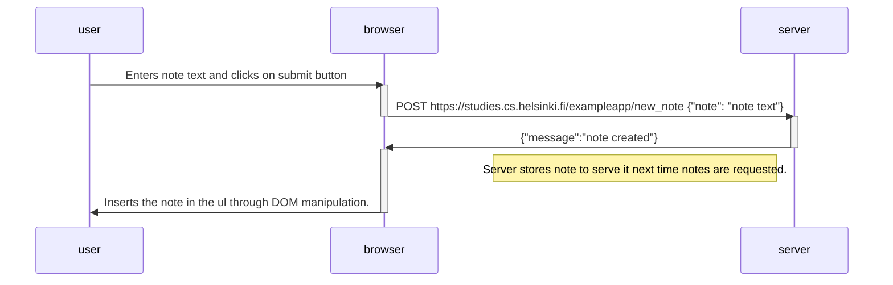

```mermaid
sequenceDiagram
    participant user
    participant browser
    participant server

    user->>browser: Enters note text and clicks on submit button
    activate browser
    browser->>server: POST https://studies.cs.helsinki.fi/exampleapp/new_note {"note": "note text"}
    deactivate browser
    activate server
    server->>browser: {"message":"note created"}
    deactivate server
    activate browser
    Note left of server: Server stores note to serve it next time notes are requested.
    browser->>user: Inserts the note in the ul through DOM manipulation.
    deactivate browser
```